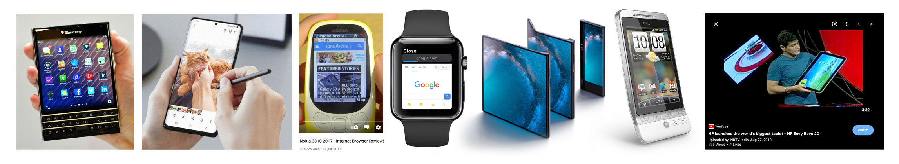

# Unpacking the webpage

Who / when / where / how a website is accessed / consumed…
A website is a tool/platform/container for accessing content: and CSS offers **directions** regarding appearance (not *obligations*). When it's on the web, you can't have control on viewing contexts, and you have to embrace this 'flexibility' of contexts. A good website is like an elastic: it expands and contracts nicely based on its content amount.

## *Good website* criteria (from a purely technical standpoint)

Some criteria to keep in mind:

- **Ressources loads fast** (under 300ms) or are splitted to avoid excessive load times
- **Interaction elements are properly timed** ([300ms, no endless transitions](https://ux.stackexchange.com/questions/66604/optimal-duration-for-animating-transitions ))
- **Coherent, semantic, and acknowledging expectable design patterns** (it's okay to be *original* and a bit of unexpectedness can be fine if thought carefully, on the other hand you'll likely have to guide your visitor about usage and expectation).
- **Suggests the website structure/hierarchy in the design** (breadcrumbs, menu as sitemap, table of contents). *Where am I?*
- **Avoid interfering with native/expected browser behaviors** and user preferences (scrolling functionalities, light/dark modes, cursor suggesting an element can be clicked, etc). 
- **Looks *good* on any devices**, screen sizes, interaction methods: [60% users on mobile devices](https://gs.statcounter.com/platform-market-share/desktop-mobile-tablet) (1 column, menu shortcuts, touch event), 40% on desktop (1 or multi-column, extended menu, mouse hover), phablets, foldable phones, mega-big ipads, etc…
- Agnostic of language directions (left-to-right, right-to-left) (more on [Material Design](https://material.io/design/usability/bidirectionality.html#mirroring-layout))
- Is **understandable / accessible without CSS** (uses appropriate html tags and page structure!!!). Can be navigated with ‘tabs’ / focus, and screen readers (visual impairments, hearing impairment, etc).
- Takes into account a ‘performance’ budget for client-side features / properties that are resource-intensive (*ie* don't animate too much properties especially if they are ressource-demanding and you stack them one on top of the other).

### Ressources optimization tricks and do's

- **Use .jpg for images**, avoid .png over 500kb (and use only for transparency or if file is smaller than .jpg), avoid .gif over 500kb (and use only for moving or if smaller than .jpg).
- Consider using .svg files (yes!) instead of .png files
- **Compress your .jpg with Photoshop** using the **'Save for Web (Legacy)'** option (under File->Export), [Shift]+[Alt]+[Cmd]+[S], with the appropriate image width resizing and the quality setting at **60** or below.
- If 'Save for Web (Legacy)' is not available, use **'Export As'** (under File->Export).
- Your **images should not be too big in relationship with the space they occupy**. Consider capping images at *2400px* width for full screen width images, *1200px* for 50% screen width, and *900px* for 33% screen width.
- If you use the html `<video>` tag, export your video to .mp4 -> https://cloudconvert.com/mp4-converter and **adjust the quality so you are at under 2mb per minute.**
- Same applies with the `<audio>` tag, use .mp3 -> https://online-audio-converter.com and **adjust so you're under 1mb / minute.**
- If your media file is verrrrrrrrrrrrry heavy, consider using Vimeo, YouTube or Soundcloud and embed it on your website using the provided embed code. Some of these services provide an API to control play/pause, volume, etc, through Javascript.
- If your page is really image-heavy, consider implementing your images with a lazyload: https://afarkas.github.io/lazysizes/index.html
- Use a CDN (Content Delivery Network) to deliver your media files: https://cloudinary.com/ (cloudinary has a free tier, [documentation](https://cloudinary.com/documentation/image_optimization)). Imagekit.io too -> https://imagekit.io/use-cases/file-upload/

### Coherent and semantic html

> What are Semantic Elements? A semantic element clearly describes its meaning to both the browser and the developer. 
> Examples of non-semantic elements: `<div>` and `<span>` - Tells nothing about its content. 
> Examples of semantic elements: `<nav>`, `<header>`, `<form>`, `<table>`, and `<article>` - Clearly defines its content.
> Read more on the [W3school](https://www.w3schools.com/html/html5_semantic_elements.asp)
  
- Cheat sheet 1: [Codecademy description of semantic elements](https://www.codecademy.com/learn/learn-html/modules/learn-semantic-html/cheatsheet)
- Cheat sheet 2: [MDN html cheatsheet](https://developer.mozilla.org/en-US/docs/Learn/HTML/Cheatsheet)
- Cheat sheet 3: [MDN html semantic blocks](https://developer.mozilla.org/en-US/docs/Glossary/Semantics#semantics_in_html)
  
*Why is it important?*

1. People with screen readers (device helpers for accessibility) can access your website
2. You put chances on your side to be future-proof 🤞
3. Your website can be indexed by search engines, can be scraped by APIs and and is also readable through 'reading mode' on safari
4. It might look better when printed, exported to .pdf, or exported to other formats

What could be a *semantic* structure inthe context of this assignment?

Use the `<figure>` tag for images / visual medias:
  
```
  <figure>
      
      <figcaption>Painting of a forest with a blue lake by Jane Doe</figcaption>
  </figure>
```

Put your footnotes in a `<footer>` tag if at the end of your document, in a `<aside>` tag is presented as a sidebar...<br>
Put your table of contents inside a `<nav>` tag.<br>
Put your thesis title inside the `<h1>` tag, the `<h1>` being inside the `<header>` tag.

### Accessibility

You can yourself make a test and press [Cmd]+[+], you'll likely zoom on the webpage (use [Cmd]+[-] for zooming out). This feature is actually used for folks with different viewing abilities that need it to see the content. Also: think about browser-activated 'dark' feature, text-to-speach devices, etc. There are dozens of thousands of possible combinations of browsers/versions + screen devices + interacting methods (hover/touch). It will be impossible to predict/force all outcomes to look *as* you wish 100%.

It is better to have less differentiation, somewhat a ‘universal’, ‘one-size-fits-all’ approach… and of course to **follow semantic html**!

### Design, mobile-first

When designing, think *mobile-first*. But what does that mean, exactly? Mobiles come in different sizes, different interacting method.



Above examples are: a device with a square screen ratio, device with stylus, slow/small/low-res device (the 3310), smart watch, device with a trackball (!), foldable screen device (!!), tablet that is bigger than a desktop (!!!)... 🥴

#### Basics for 'mobile' device

##### Design

1. Screen size 320px for 'small' mobile devices (iPhone 5), 360-375px for 'average' and 400-420px for 'larger' devices. *If it works for 320px, it works for any devices.*
2. Most mobiles can't reproduce 'hover' interactions: there's no mouse. On the other hand, you can use 'touch' events if the way of interacting is to touch a screen. If you use 'hover' interactions to convey interactivity, think twice about another potential 'non-hover' visual cue.
3. The content is likely to be displayed on a one column layout. Space being scarce, you don't want a 'fixed' navigation element to take too much space on your layout. You can hide these in a element that expands (accordion-like, a sidebar, a hamburger menu...) or appear/dissapear based on scroll direction. Or you can choose to avoid menu elements and make sure your pages have a link to a 'next' content and a 'back to index' link...
5. Think of the invisible structure of your website, where every html tag is a box, from main container boxes to sub-containers, and then your content inside these boxes.
6. **Paper and pen can be useful!** Draw your website's structure on a piece of paper, this will help visualize what contains what.

##### Code, debug and test, responsive / mobile-friendly

1. Use **CSS3 units** such as relative ems (rem), viewport units (`vw`, `vh`, `vmin`, `vmax`), variables (either CSS variables: `--my-variable: myvalue;`, or SASS variables: `$myvariable = myvalue;`
2. The **`flexbox`** CSS property is super handy to set up a layout. You can easily change your order by changing the `flex` properties inside your `@media-queries` ! https://css-tricks.com/snippets/css/a-guide-to-flexbox/
3. Use the development tools to simulate your website at several screen sizes. On Google Chrome -> [Shift]+[Cmd]+[C] | on Firefox -> or [Alt]+[Cmd]+[I]. Then on both options you can find a mobile device / tablet icon that allows you to simulate several screen sizes.
4. But don't forget to also **test on a real mobile device** (for this you'll need to deploy your website online first, normally in a temporary/secret place but for this exercice you can push it online for testing purposes and implement further modifications afterwards on the same repository). Example of why test on a real device: *the 'rubber band' scrolling effect with [showing/hiding browser nav bar](https://www.google.com/search?q=ios+safari+navbar+scroll&source=lnms&tbm=isch) in iOS safari or [overscrolling issues](https://css-tricks.com/almanac/properties/o/overscroll-behavior/) from a modal to the page's body, or the way a css `vh` unit [is calculating differing on mobiles](https://dev.to/maciejtrzcinski/100vh-problem-with-ios-safari-3ge9), devices with a [notch](https://css-tricks.com/the-notch-and-css/) hiding content, etc.* Or **just the feeling of actually touching your website buttons/links** might make you realize they are too small/difficult to touch?

### Performance issues

Some CSS properties can consume a lot of ressources. Most of you won't reach the point where your browser will start behaving *slower* but it's possible.

**Tricks**

- filter (blur) and mix-blend-mode, especially if stacked on each others, using high value (for blur), or applied on heavy elements like video.
- use the `will-change` property on the parent of the ressource-heavy element, and specify the energy-hungry property within the `will-change` property.
- Prefer the css `transform` property over `top | left | right | bottom` if you intend to animate (via a transition) the property.


## A list of link ressources to perform website tests

Features issues & support:

- **Can I use**..., support tables for HTML5, CSS3, etc: https://caniuse.com
- **Stack overflow** (Q&A for developers, problem-sharing and fixing): https://stackoverflow.com/questions

Markup testing:

- **W3C validator markup** testing: https://validator.w3.org/ (free)

Cross-device / screens testing:

- **Browserstack** (test on multiple screens or user agents): https://www.browserstack.com/ (€)

Performance testing / audit:

- **Google Lighthouse**: https://developers.google.com/web/tools/lighthouse, use [Shift]+[⌘]+[C] in *Google Chrome*
- **Website Speed Test**: https://tools.pingdom.com/
- **Website Carbon Calculator**: https://www.websitecarbon.com/ (checks the CO2 emissions of your website)

Accessibility testing / audit:

- **WebAIM**: https://webaim.org/techniques/keyboard/ (free)
- **WAVE** (website accessibility evaluation tool): https://wave.webaim.org (free)
- **Web accessibility .com**: https://www.webaccessibility.com (free, €)
- **WebAIM** (contrast checker): https://webaim.org/resources/contrastchecker/

Social medias scrapers / debuggers:

- **Facebook sharing debugger tool**: https://developers.facebook.com/tools/debug/ (free)
- **Twitter cards validator tool**: https://cards-dev.twitter.com/validator (free)
- **LinkedIn post inspector**: https://www.linkedin.com/post-inspector (free)

Checklists:

- **The Front-end check-list** https://github.com/thedaviddias/Front-End-Checklist
- **A11y checklist**: https://www.a11yproject.com/checklist/
