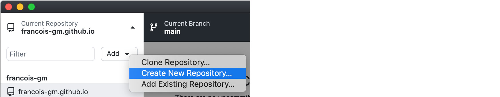

# Github pages

## Ways of connecting / using...

- Terminal: either Git ([documentation](https://git-scm.com/download/mac)),or the Github CLI ([documentation](https://github.com/cli/cli)) *
- Desktop app: Github Desktop**, ([Download here](https://desktop.github.com))

\* CLI = Command User Interface, ** GUI = Graphic User Interface

### a) Git (...*or* Github CLI)

> Quick reminder for Terminal:
> 
> Navigate by using `cd`:
> ```
> cd path/to/document
> ```
> 
> Use `ls` to get a list of what's available.<br> 
> The command `cd ../` move one level up.<br>
> If you start writing a folder name, use the [Tab] key from your keyboard to autocomplete.
> 
> [Cheatsheet Terminal](https://github.com/0nn0/terminal-mac-cheatsheet#english-version)

1. Be sure you have [Homebrew](https://brew.sh) (a package manager) installed on your computer (if Mac / Linux). Check by typing in 'Terminal': `brew -v` To install, type this in 'Terminal':

```
/bin/bash -c "$(curl -fsSL https://raw.githubusercontent.com/Homebrew/install/HEAD/install.sh)"
```

2. Then, install Git (https://git-scm.com/download/mac) by typing in 'Terminal': `brew install git`, or if installed update it with `brew upgrade git`. (Github CLI can be installed by typing `brew install gh`) ()

- You might need to update Xcode (if Mac)... if an error asks for Xcode update with a specific version, download here: https://xcodereleases.com
- You might need to make sure your github account has authentification tokens enabled: https://stackoverflow.com/questions/68775869/support-for-password-authentication-was-removed-please-use-a-personal-access-to

[Cheatsheet Git](https://github.com/0nn0/git-basics-cheatsheet)

### b) Desktop app

[Download here](https://desktop.github.com), and follow the installation steps...

## Deploy your first page

Follow the official documentation instructions here: https://pages.github.com

### Folder name structure

In your Githup Desktop App (top right corner of the app):
- `Add -> Create new repository`
- 
- Naming convention: `go-theses-[year]-firstname-lastname` (example: go-theses-22-francois-girard-meunier)
- Path: *where you will be working on your thesis from your computer desktop drive.*
- Other options: *as you wish (you can always add these files later if you want).*
- After you have created your repository, publish it on the KABK Github (top right again)
- 
- Then, choose: `Github.com`
- Name: *same as before (follows the name convention)*
- Make sure 'keep this code private' is **not checked**! Otherwise your website won't be available online (!)
- Organization = `kabk`

**Tadah!**

- 

- Now, you can do the following actions in order to 'update' your website 'fetch', 'commit', 'push' and 'pull'.
- This will be your URL: https://kabk.github.io/go-theses-22-francois-girard-meunier
- But it throws an error 404! Oops.
- Just add an `index.html` file to your folder, make a 'commit', and 'push' that commit: this will update the github folder with your changes.
- Then, on the Github website: https://github.com/kabk/
- Go to your repository folder, click over it. Once inside it, go to -> `settings`. Then -> `Pages`. For `source`, choose `main`, and **save**.
- 
- 

Now it should be public and online at the said url :)


